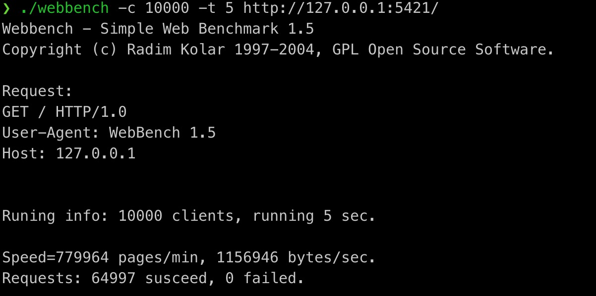

# MyTinyWebServer


## Introduction
This is a personal network programming project,
the main purpose is to review the knowledge learned in school.
This project is a web server written in C++11,
which implements GET parsing and response,
can process static resources,
implements asynchronous logging to record server status,
and implements a timer to close timeout links.


## Environment
* Operating System: Ubuntu 20.04.4 LTS
* Compiler: [Camke 3.22.2](https://cmake.org/cmake/help/v3.22/release/3.22.html)
* Unit Testing Framework: [GoogleTest 1.11.0](https://github.com/google/googletest/tree/c9461a9b55ba954df0489bab6420eb297bed846b)
* Stress Testing Tool: [WebBench 1.5](https://github.com/EZLippi/WebBench)


## Instructions
```bash
# Clone and build
git clone https://github.com/mushanshanshan/TinyWebServer
cd TinyWebServer

mkdir build
cd build

# All parameters are defined in src/utils/param.h, please modify according to your needs
cmake .. && cmake --build .

# Unit Test
./MyWebServer_unit_test

# Run Server
./MyWebServer
```


# Implementation Details

The whole project mainly includes the following modules:

* Web server based on Epoll, thread pool and Reactor model.
* Timer based on min heap.
* Asynchronous log system based on singleton pattern and blocking queue.
* Circular buffer based on std::vector<char>.


# Test Result

* WebBench 1.5 Result:
  


# Something can be improved
- [ ] Upgrade from single reactor to multi reactor
- [ ] Receive multiple clients from each epoll_wait
- [ ] Replaced blocking queue with a lock-free queue
- [ ] Re-implement thread pool with lock-free queue
- [ ] Replaced with a double-buffer logger design to reduce the number of disk writes


# Reference
* 《Linux 多线程服务端编程 使用 muduo C++ 网络库》[@chenshuo](https://github.com/chenshuo)
* 《Linux高性能服务器编程》
* [WebServer](https://github.com/linyacool/WebServer)
* [TKeed](https://github.com/linw7/TKeed)
* [TinyWebServer](https://github.com/qinguoyi/TinyWebServer)